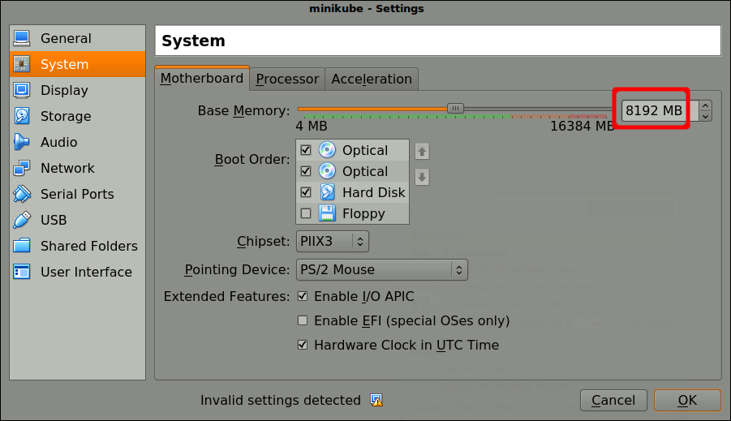
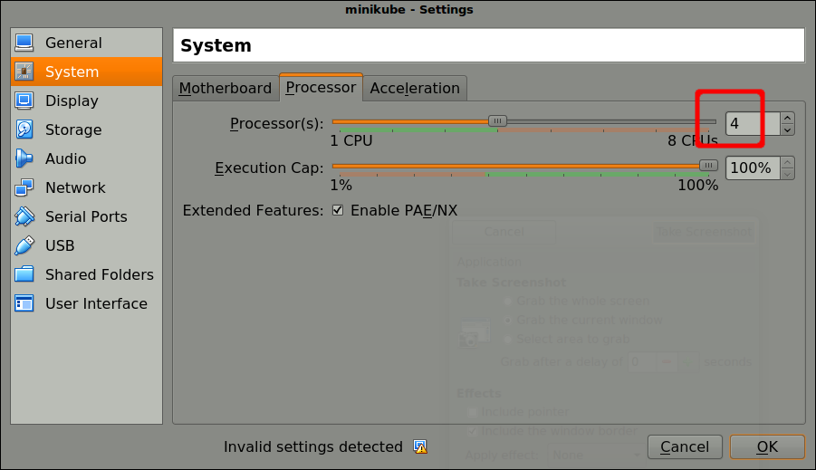

# Stateful Cassandra with Kubernetes

Create a multi-seat Cassandra database with Kubernetes

## Motivation

Create a stateful [Cassandra](http://cassandra.apache.org/) database using a stateful set and then spin up two replicas to make a Cassandra ring.

[Note that this example is Debian-based and uses the OpenJDK 8 JRE rather than a proprietary Java (see [Dockerfile](./Dockerfile)).]

We will then use the Cassandra [nodetool utility](http://wiki.apache.org/cassandra/NodeTool) to verify the Cassandra ring status.

In terms of a data model, we will use the `users` table from [Twissandra](http://github.com/twissandra/twissandra) (Twissandra is a Twitter clone).

We will set up a `keyspace` and a `column family`, insert some data into the `column family` and then verify replication.

[Terminology: a Cassandra `keyspace` corresponds to a relational database while a `column family` corresponds to a relational table.]

Next we will scale up the replica count and check for evidence of ___bootstrapping___ (the process by which a new node is onboarded).

Finally, we will tear everything down and clean up.

This exercise follows on from my [Replicated MySQL (Dynamic Volumes)](http://github.com/mramshaw/Kubernetes/tree/master/Replicated%20MySQL%20(Dynamic%20Volumes)) exercise.

## Contents

The content are as follows:

* [Prerequisites](#prerequisites)
* [Method](#Method)
* [Preparation](#preparation)
    * [Increase minikube's working memory](#increase-minikubes-working-memory)
    * [Increase minikube's processors](#increase-minikubes-processors)
    * [imagePullPolicy](#imagepullpolicy)
    * [Pull Cassandra image](#pull-cassandra-image)
    * [Shutdown period](#shutdown-period)
* [Startup](#startup)
    * [Minikube limits](#minikube-limits)
    * [Memory](#memory)
* [Testing](#testing)
    * [Cassandra service](#cassandra-service)
    * [Cassandra pods](#cassandra-pods)
    * [Master pod](#master-pod)
    * [First replica](#first-replica)
    * [Second replica](#second-replica)
    * [Ring status](#ring-status)
    * [Third replica](#third-replica)
* [Teardown](#teardown)
* [Reference](#reference)
* [Versions](#versions)
* [To Do](#to-do)
* [Credits](#credits)

## Prerequisites

* __kubectl__ installed.
* __minikube__ installed.

## Method

There are generally three ways of operating in the cloud:

1. Locally with __minikube__
2. In the cloud, using a dashboard
3. Locally as well as in the cloud, using command-line tools

In this document we will discuss the first option.

## Preparation

The following steps may not be absolutely necessary, but will probably save time and aggravation.

#### Increase minikube's working memory

Cassanda is a ___beast___, so we will need to allocate ___lots___ of memory:



#### Increase minikube's processors

Likewise we will need to allocate ___lots___ of processors:



#### imagePullPolicy

In order to save on network traffic, we will change the [image pull policy](http://kubernetes.io/docs/concepts/containers/images/#updating-images)
 from the recommended __Always__ to __IfNotPresent__ (the default value).

This is not a good idea for a production deployment but will be acceptable for testing.

#### Pull Cassandra image

To avoid the downloading phase when running __minikube__, perform the following steps:

1. `minikube start`
2. `minikube ssh`
3. `docker images` (optional)
4. `docker pull gcr.io/google-samples/cassandra:v13`
5. `docker images` (optional)
6. `exit`
7. `minikube stop`

This should look as follows:

```bash
$ minikube start
Starting local Kubernetes v1.10.0 cluster...
Starting VM...
Getting VM IP address...
Moving files into cluster...
Downloading kubeadm v1.10.0
Downloading kubelet v1.10.0
Finished Downloading kubeadm v1.10.0
Finished Downloading kubelet v1.10.0
Setting up certs...
Connecting to cluster...
Setting up kubeconfig...
Starting cluster components...
Kubectl is now configured to use the cluster.
Loading cached images from config file.
$ minikube ssh
                         _             _            
            _         _ ( )           ( )           
  ___ ___  (_)  ___  (_)| |/')  _   _ | |_      __  
/' _ ` _ `\| |/' _ `\| || , <  ( ) ( )| '_`\  /'__`\
| ( ) ( ) || || ( ) || || |\`\ | (_) || |_) )(  ___/
(_) (_) (_)(_)(_) (_)(_)(_) (_)`\___/'(_,__/'`\____)

$ docker images
REPOSITORY                                    TAG                 IMAGE ID            CREATED             SIZE

< ... >

$ docker pull gcr.io/google-samples/cassandra:v13
v13: Pulling from google-samples/cassandra
d093dc0d702b: Pull complete 
ef5352433e74: Pull complete 
d77cb3c0fe42: Pull complete 
Digest: sha256:7a3d20afa0a46ed073a5c587b4f37e21fa860e83c60b9c42fec1e1e739d64007
Status: Downloaded newer image for gcr.io/google-samples/cassandra:v13
$ docker images
REPOSITORY                                    TAG                 IMAGE ID            CREATED             SIZE

gcr.io/google-samples/cassandra            v13                 d4455a1f13b6        9 months ago        235MB

$ exit
logout
$ minikube stop
Stopping local Kubernetes cluster...
Machine stopped.
$
```

Once __gcr.io/google-samples/cassandra:v13__ (235 MB) shows as an available Docker image in the minikube repository, the downloading portion should be complete. Docker images will persist in minikube until a `minikube delete` command is run.

#### Shutdown period

We will reduce the `terminationGracePeriodSeconds` from the recommended __1800__ (30 minutes in seconds) to __180__ (3 minutes in seconds).

This is probably not ideal for production use, where in-flight requests should have a long timeout,
but is probably an acceptable grace period for testing purposes.

## Startup

Now that we have all of our Docker images present, restart `minikube`.

[Note that this requires running `minikube stop` (as shown above) first.]

#### Minikube limits

The tutorial recommends the following __minikube__ limits:

	$ minikube start --memory 5120 --cpus=4

[This corresponds to 5,120 MB of RAM and 4 CPUs]

This should look roughly as follows:

```bash
$ minikube start --memory 5120 --cpus=4
Starting local Kubernetes v1.10.0 cluster...
Starting VM...
Getting VM IP address...
Moving files into cluster...
Setting up certs...
Connecting to cluster...
Setting up kubeconfig...
Starting cluster components...
Kubectl is now configured to use the cluster.
Loading cached images from config file.
$
```

In general, rather than run containers on virtual machines _in a virtual machine_, it is probably a better idea to run this exercise in the cloud. With multiple levels of abstraction it can be very hard to grok what is going on and hardware limitations will probably create lots of restarts simply due to hardware limitations, both of which will make debugging configuration errors all that much harder.

#### Memory

It may be necessary to adjust the memory requirements as specified in `cassandra-service.yaml`.

But try the recommended settings first, and then adjust as necessary.

## Testing

We will create a Cassandra service and then Cassandra pods.

#### Cassandra service

Start a Cassandra service:

```bash
$ kubectl create -f cassandra-service.yaml 
service "cassandra" created
$
```

Verify it (optional) as follows:

```bash
$ kubectl get svc cassandra
NAME        TYPE        CLUSTER-IP   EXTERNAL-IP   PORT(S)    AGE
cassandra   ClusterIP   None         <none>        9042/TCP   14s
$
```

#### Cassandra pods

Spin up our statefulset as follows:

    $ kubectl create -f cassandra-statefulset.yaml

This should look as follows:

```bash
$ kubectl create -f cassandra-statefulset.yaml
statefulset.apps "cassandra" created
storageclass.storage.k8s.io "fast" created
$
```

If instead it looks as follows (note the warning about storage class "fast" already existing):

```bash
$ kubectl create -f cassandra-statefulset.yaml
statefulset.apps "cassandra" created
Error from server (AlreadyExists): error when creating "cassandra-statefulset.yaml": storageclasses.storage.k8s.io "fast" already exists
$
```

Then the [storage classes](http://kubernetes.io/docs/concepts/storage/storage-classes/) can be listed as follows:

```bash
$ kubectl get storageclasses
NAME                 PROVISIONER                AGE
fast                 k8s.io/minikube-hostpath   6d
standard (default)   k8s.io/minikube-hostpath   6d
$
```

[Note that this is only a ___warning___ message; everything will still spin up as expected.]

We can check on the storage allocation as follows:

```bash
$ kubectl get pv
NAME                                       CAPACITY   ACCESS MODES   RECLAIM POLICY   STATUS    CLAIM                                STORAGECLASS   REASON    AGE
pvc-3e1bdaeb-ef45-11e8-8e5e-080027ef9b14   1Gi        RWO            Delete           Bound     default/cassandra-data-cassandra-0   fast                     11m
pvc-4bc425c2-ef45-11e8-8e5e-080027ef9b14   1Gi        RWO            Delete           Bound     default/cassandra-data-cassandra-1   fast                     11m
pvc-6eca05ba-ef45-11e8-8e5e-080027ef9b14   1Gi        RWO            Delete           Bound     default/cassandra-data-cassandra-2   fast                     10m
$ kubectl get pvc
NAME                         STATUS    VOLUME                                     CAPACITY   ACCESS MODES   STORAGECLASS   AGE
cassandra-data-cassandra-0   Bound     pvc-3e1bdaeb-ef45-11e8-8e5e-080027ef9b14   1Gi        RWO            fast           11m
cassandra-data-cassandra-1   Bound     pvc-4bc425c2-ef45-11e8-8e5e-080027ef9b14   1Gi        RWO            fast           11m
cassandra-data-cassandra-2   Bound     pvc-6eca05ba-ef45-11e8-8e5e-080027ef9b14   1Gi        RWO            fast           10m
$
```

Once all of our storage is allocated, repeat the following command until all three pods show as up:

    $ kubectl get statefulset cassandra

[Depending upon resource availability, this may take some time.]

Eventually, this should show as follows:

```bash
$ kubectl get statefulset cassandra
NAME        DESIRED   CURRENT   AGE
cassandra   3         3         6m
$
```

It may take a while for things to spin up, repeat the next command until pod __cassandra-0__ shows as __Running__:

	$ kubectl get pods -l app=cassandra -o wide

Once that is done, progress can be monitored as follows:

	$ kubectl logs cassandra-0

Eventually, something like the following should indicate that the master pod is up:

```
...
INFO  17:30:10 Starting listening for CQL clients on /0.0.0.0:9042 (unencrypted)...
...
```

There are many patterns of database replication: in my MySQL exercise, the replication was as a master-slave
relationship - with the replicas being read-only. Here we are creating equal replicas (or __peers__), but they
are created __sequentially__ (i.e. daisy-chained); by convention, the first replica is referred to as the master.
The replicas are then *copied* from the master once the master is up and running.

#### First replica

We can verify the execution of the first replica as follows:

	$ kubectl logs cassandra-1

Something like the following should indicate that it is up:

```
...
INFO  19:33:33 Starting listening for CQL clients on /0.0.0.0:9042 (unencrypted)...
INFO  19:33:33 Not starting RPC server as requested. Use JMX (StorageService->startRPCServer()) or nodetool (enablethrift) to start it
INFO  19:33:48 Handshaking version with /172.17.0.9
INFO  19:33:48 Handshaking version with /172.17.0.9
INFO  19:33:48 Node /172.17.0.9 is now part of the cluster
INFO  19:33:48 InetAddress /172.17.0.9 is now UP
...
```

#### Second replica

We can verify the execution of the second replica as follows:

	$ kubectl logs cassandra-2

Once again, something like the following indicates that the replica is up:

```
...
INFO  19:34:33 Starting listening for CQL clients on /0.0.0.0:9042 (unencrypted)...
...
```

#### Ring status

We will use the Cassandra [nodetool utility](http://wiki.apache.org/cassandra/NodeTool) to display the status of the ring:

```bash
$ kubectl exec -it cassandra-0 -- nodetool status
Datacenter: DC1-K8Demo
======================
Status=Up/Down
|/ State=Normal/Leaving/Joining/Moving
--  Address     Load       Tokens       Owns (effective)  Host ID                               Rack
UN  172.17.0.7  104.55 KiB  32           75.5%             db74e316-253e-483c-b5fd-59670642a3dc  Rack1-K8Demo
UN  172.17.0.9  15.38 KiB  32           67.4%             75ae1ee3-4f33-492c-99e5-065194152136  Rack1-K8Demo
UN  172.17.0.8  103.81 KiB  32           57.0%             19b9f0d7-cafd-46fd-be91-6be1e71617d0  Rack1-K8Demo

$
```

#### Third replica

Spin up a third replica as follows:

    $ kubectl edit statefulset cassandra

Change the number of replicas to 4 and save.

Repeat the following command until `cassandra-3` shows as __running__:

    $ kubectl get pods -l app=cassandra -o wide

Use the [nodetool utility](http://wiki.apache.org/cassandra/NodeTool) again to display the status of the ring:

```bash
$ kubectl exec -it cassandra-0 -- nodetool status
Datacenter: DC1-K8Demo
======================
Status=Up/Down
|/ State=Normal/Leaving/Joining/Moving
--  Address      Load       Tokens       Owns (effective)  Host ID                               Rack
UN  172.17.0.7   104.55 KiB  32           57.2%             db74e316-253e-483c-b5fd-59670642a3dc  Rack1-K8Demo
UN  172.17.0.9   84.81 KiB  32           58.9%             75ae1ee3-4f33-492c-99e5-065194152136  Rack1-K8Demo
UN  172.17.0.8   103.81 KiB  32           38.7%             19b9f0d7-cafd-46fd-be91-6be1e71617d0  Rack1-K8Demo
UN  172.17.0.10  103.82 KiB  32           45.2%             3ea44897-ab93-4c52-99b2-0e4ead1425b6  Rack1-K8Demo

$
```

## Teardown

Optionally, open another console to watch the teardown as follows (Ctrl-C to end):

    $ kubectl get pods -l app=cassandra -o wide --watch

[Note that the pods are torn down in reverse order.]

In the original console, run the following command:

```bash
$ grace_period=$(kubectl get po cassandra-0 -o=jsonpath='{.spec.terminationGracePeriodSeconds}') \
  && kubectl delete statefulset -l app=cassandra \
  && echo "Sleeping for $grace_period seconds" \
  && sleep $grace_period \
  && kubectl delete pvc -l app=cassandra
```

[This will wait for the specified grace period and then delete the persistent volumes.]

In the second console, things should look as follows:

```bash
$ kubectl get pods -l app=cassandra -o wide --watch
NAME          READY     STATUS    RESTARTS   AGE       IP           NODE
cassandra-0   1/1       Running   0          19m       172.17.0.7   minikube
cassandra-1   1/1       Running   0          17m       172.17.0.8   minikube
cassandra-2   1/1       Running   0          16m       172.17.0.9   minikube
cassandra-2   1/1       Terminating   0         17m       172.17.0.9   minikube
cassandra-2   0/1       Terminating   0         17m       172.17.0.9   minikube
cassandra-2   0/1       Terminating   0         17m       172.17.0.9   minikube
cassandra-2   0/1       Terminating   0         17m       172.17.0.9   minikube
cassandra-1   1/1       Terminating   0         18m       172.17.0.8   minikube
cassandra-1   0/1       Terminating   0         18m       172.17.0.8   minikube
cassandra-1   0/1       Terminating   0         18m       172.17.0.8   minikube
cassandra-1   0/1       Terminating   0         18m       172.17.0.8   minikube
cassandra-0   1/1       Terminating   0         20m       172.17.0.7   minikube
cassandra-0   0/1       Terminating   0         20m       <none>    minikube
^C$
```

[Note that the pods are torn down in reverse order.]

In the original console, things should look as follows:

```bash
$ grace_period=$(kubectl get po cassandra-0 -o=jsonpath='{.spec.terminationGracePeriodSeconds}') \
>   && kubectl delete statefulset -l app=cassandra \
>   && echo "Sleeping for $grace_period seconds" \
>   && sleep $grace_period \
>   && kubectl delete pvc -l app=cassandra
statefulset.apps "cassandra" deleted
Sleeping for 180 seconds
persistentvolumeclaim "cassandra-data-cassandra-0" deleted
persistentvolumeclaim "cassandra-data-cassandra-1" deleted
persistentvolumeclaim "cassandra-data-cassandra-2" deleted
$
```

Verify that the persistent volumes have been disposed of as follows:

```bash
$ kubectl get pvc
No resources found.
$ kubectl get pv
No resources found.
$
```

Optionally, delete the [storage class](http://kubernetes.io/docs/concepts/storage/storage-classes/):

    $ kubectl delete storageclass fast

[This will get rid of the annoying warning, as listed above.]

Delete the service:

```bash
$ kubectl delete service -l app=cassandra
service "cassandra" deleted
$
```

Finally, stop minikube:

```bash
$ minikube stop
```

## Reference

General overview of Cassandra (sound quality is very poor):

    http://www.se-radio.net/2011/10/episode-179-cassandra-with-jonathan-ellis

Backing up and restoring Cassandra data:

    http://docs.datastax.com/en/cassandra/3.0/cassandra/operations/opsBackupRestore.html

Bootstrapping:

    http://thelastpickle.com/blog/2017/05/23/auto-bootstrapping-part1.html

Twissandra:

    http://github.com/twissandra/twissandra

## Versions

* kubectl	__2018.09.17__
* minikube	__v0.30.0__

## To Do

- [ ] <strike>Add database / replica queries using `cqlsh`</strike>
- [ ] Backport database / replica queries from [Python-Cassandra](http://github.com/mramshaw/Python_Cassandra)
- [x] Investigate `storageclasses.storage.k8s.io "fast" already exists` warning message
- [ ] Investigate [Seed providers](http://github.com/kubernetes/examples/blob/master/cassandra/java/README.md)

## Credits

Based on:

    http://kubernetes.io/docs/tutorials/stateful-application/cassandra/

[Well worth a read.]
